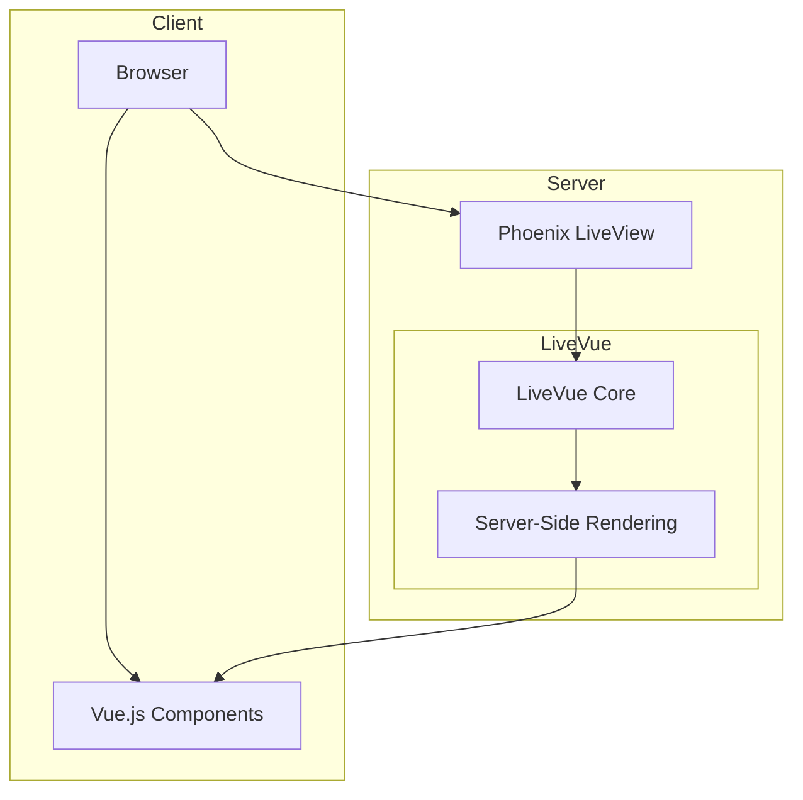

```mermaid
flowchart TB
    subgraph Client
        Browser["Browser"]
        VueComponents["Vue.js Components"]
    end
    
    subgraph Server
        subgraph LiveVue
            LiveVueCore["LiveVue Core"]
            SSRModule["Server-Side Rendering"]
        end
        Phoenix["Phoenix LiveView"]
    end
    
    Browser --> VueComponents
    Browser --> Phoenix
    Phoenix --> LiveVueCore
    LiveVueCore --> SSRModule
    SSRModule --> VueComponents
```
