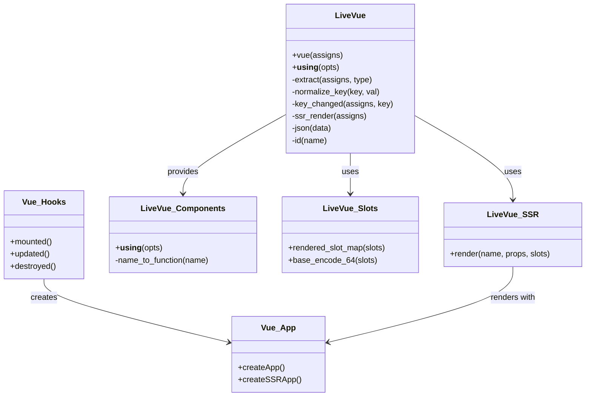

```mermaid
classDiagram
    class LiveVue {
        +vue(assigns)
        +__using__(opts)
        -extract(assigns, type)
        -normalize_key(key, val)
        -key_changed(assigns, key)
        -ssr_render(assigns)
        -json(data)
        -id(name)
    }
    
    class LiveVue_SSR {
        +render(name, props, slots)
    }
    
    class LiveVue_Components {
        +__using__(opts)
        -name_to_function(name)
    }
    
    class LiveVue_Slots {
        +rendered_slot_map(slots)
        +base_encode_64(slots)
    }
    
    class Vue_Hooks {
        +mounted()
        +updated()
        +destroyed()
    }
    
    class Vue_App {
        +createApp()
        +createSSRApp()
    }
    
    LiveVue --> LiveVue_SSR : uses
    LiveVue --> LiveVue_Slots : uses
    LiveVue --> LiveVue_Components : provides
    Vue_Hooks --> Vue_App : creates
    LiveVue_SSR --> Vue_App : renders with
```
