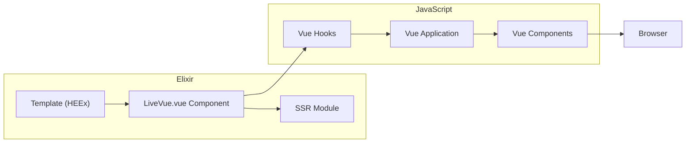

```mermaid
flowchart LR
    subgraph Elixir
        Template["Template (HEEx)"]
        LiveVueComponent["LiveVue.vue Component"]
        SSRModule["SSR Module"]
    end
    
    subgraph JavaScript
        Hooks["Vue Hooks"]
        VueApp["Vue Application"]
        Components["Vue Components"]
    end
    
    Client["Browser"]
    
    Template --> LiveVueComponent
    LiveVueComponent --> SSRModule
    LiveVueComponent --> Hooks
    Hooks --> VueApp
    VueApp --> Components
    Components --> Client
```
