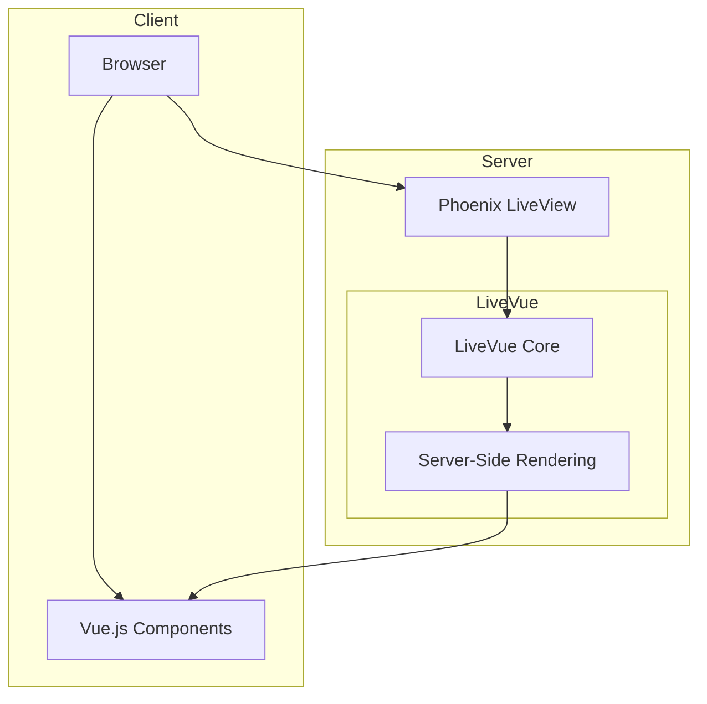
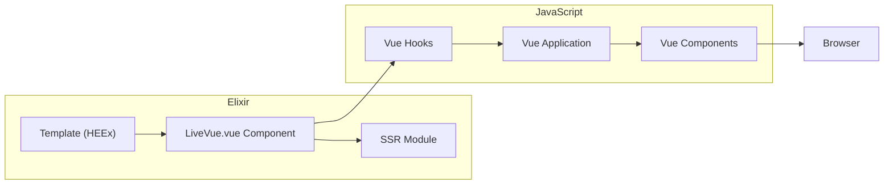
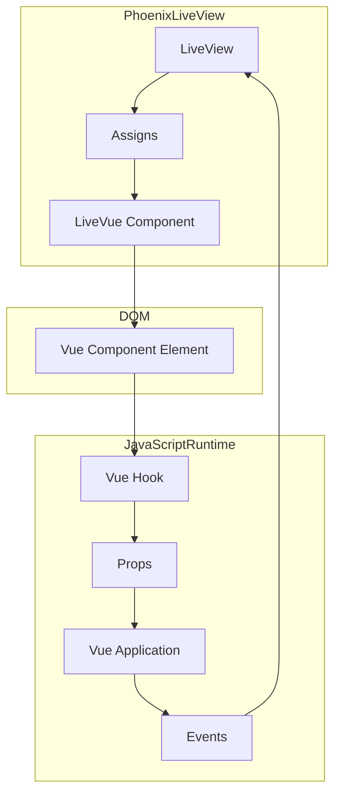
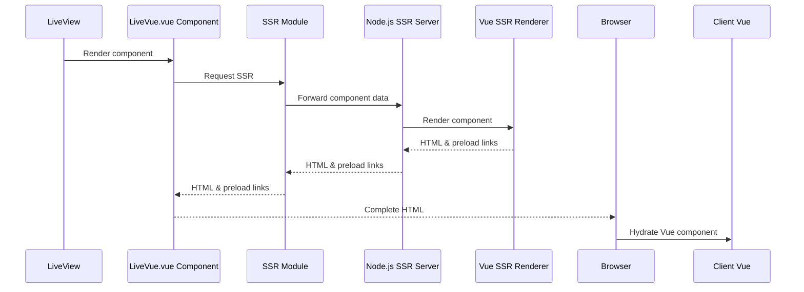
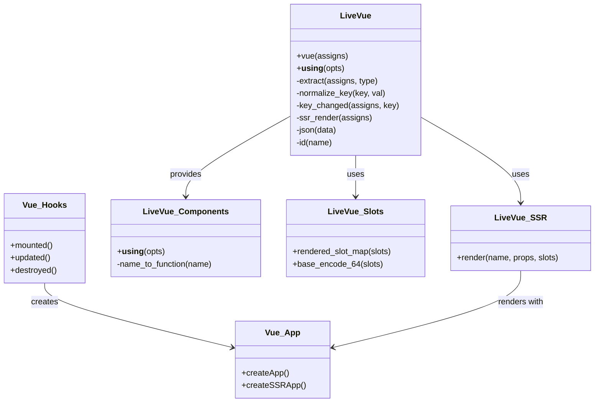
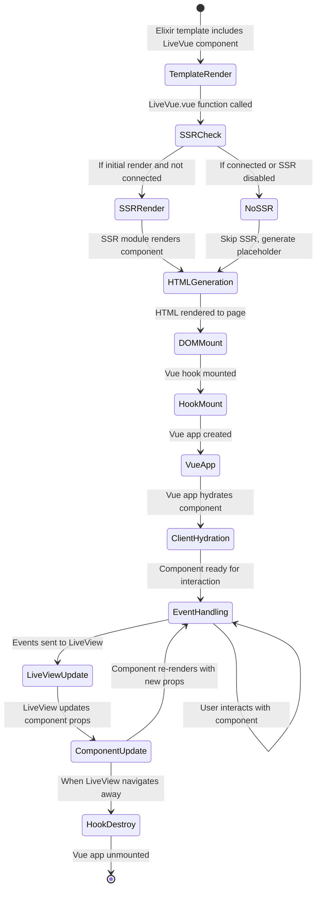

# LiveVue Architecture Diagrams

This document contains various diagrams explaining the architecture of LiveVue.

## Architecture

## Component Flow

## Data Flow

## Ssr Process

## Class Diagram

## Lifecycle

