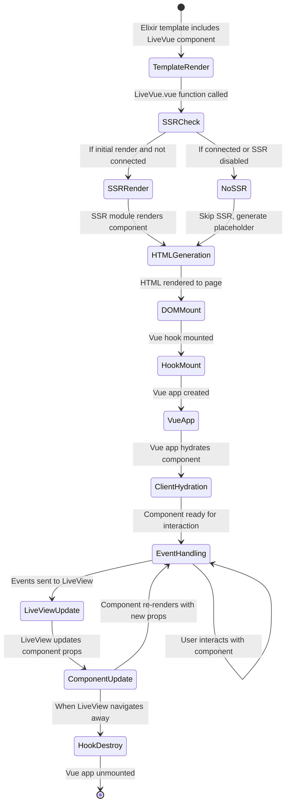

```mermaid
stateDiagram-v2
    [*] --> TemplateRender: Elixir template includes LiveVue component
    TemplateRender --> SSRCheck: LiveVue.vue function called
    
    SSRCheck --> SSRRender: If initial render and not connected
    SSRCheck --> NoSSR: If connected or SSR disabled
    
    SSRRender --> HTMLGeneration: SSR module renders component
    NoSSR --> HTMLGeneration: Skip SSR, generate placeholder
    
    HTMLGeneration --> DOMMount: HTML rendered to page
    
    DOMMount --> HookMount: Vue hook mounted
    HookMount --> VueApp: Vue app created
    VueApp --> ClientHydration: Vue app hydrates component
    
    ClientHydration --> EventHandling: Component ready for interaction
    EventHandling --> EventHandling: User interacts with component
    
    EventHandling --> LiveViewUpdate: Events sent to LiveView
    LiveViewUpdate --> ComponentUpdate: LiveView updates component props
    ComponentUpdate --> EventHandling: Component re-renders with new props
    
    ComponentUpdate --> HookDestroy: When LiveView navigates away
    HookDestroy --> [*]: Vue app unmounted
```
