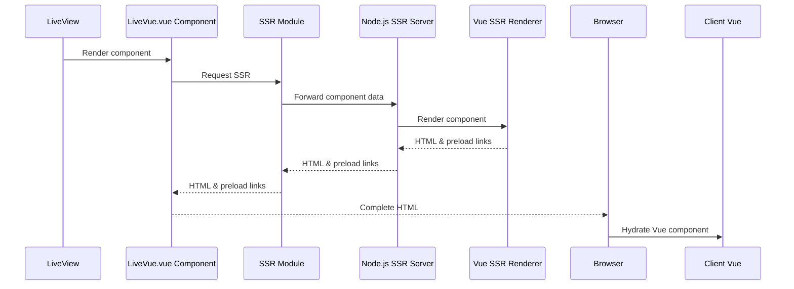

```mermaid
sequenceDiagram
    participant LV as LiveView
    participant LVC as LiveVue.vue Component
    participant SSR as SSR Module
    participant Node as Node.js SSR Server
    participant VueSSR as Vue SSR Renderer
    participant Browser
    participant Client as Client Vue
    
    LV->>LVC: Render component
    LVC->>SSR: Request SSR
    SSR->>Node: Forward component data
    Node->>VueSSR: Render component
    VueSSR-->>Node: HTML & preload links
    Node-->>SSR: HTML & preload links
    SSR-->>LVC: HTML & preload links
    LVC-->>Browser: Complete HTML
    Browser->>Client: Hydrate Vue component
```
