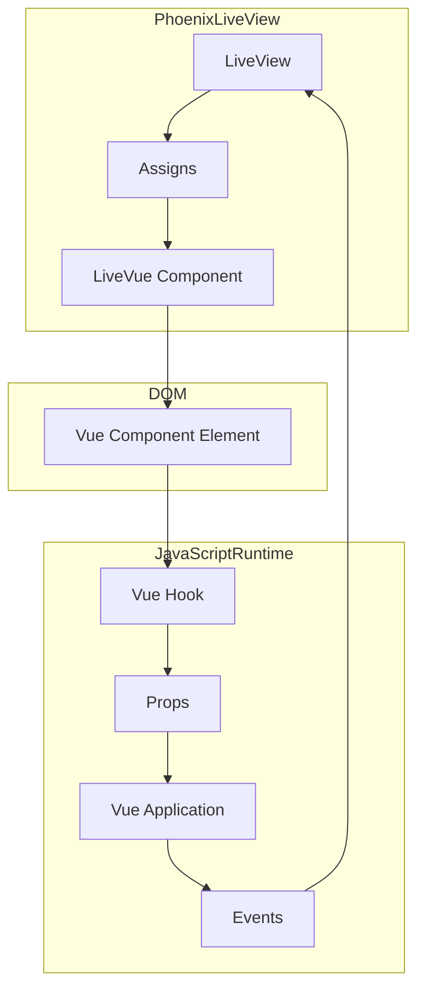

```mermaid
flowchart TD
    subgraph PhoenixLiveView
        LiveView["LiveView"]
        Assigns["Assigns"]
        LiveVueComponent["LiveVue Component"]
    end
    
    subgraph JavaScriptRuntime
        Hook["Vue Hook"]
        VueApp["Vue Application"]
        Props["Props"]
        Events["Events"]
    end
    
    subgraph DOM
        Element["Vue Component Element"]
    end
    
    LiveView --> Assigns
    Assigns --> LiveVueComponent
    LiveVueComponent --> Element
    Element --> Hook
    Hook --> Props
    Props --> VueApp
    VueApp --> Events
    Events --> LiveView
```
