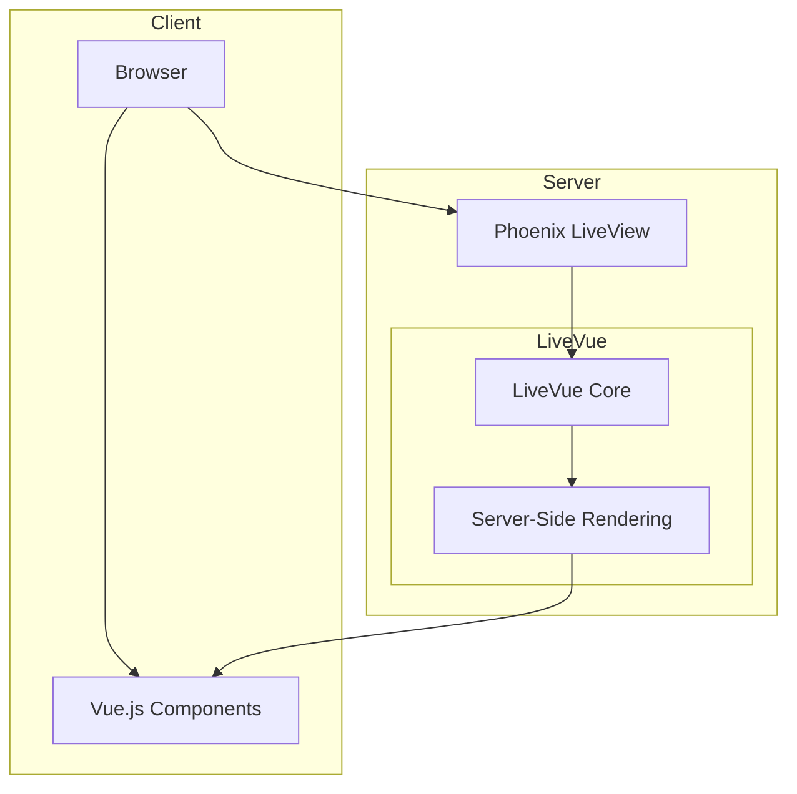
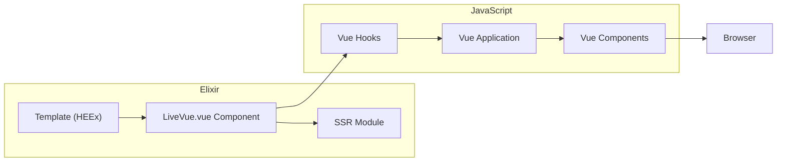
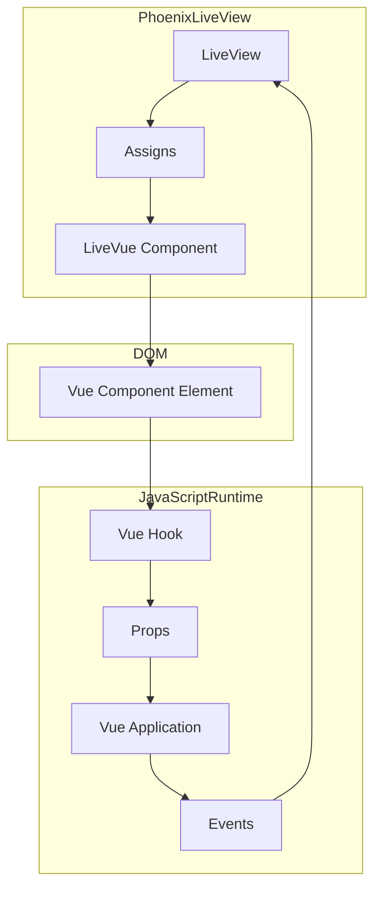
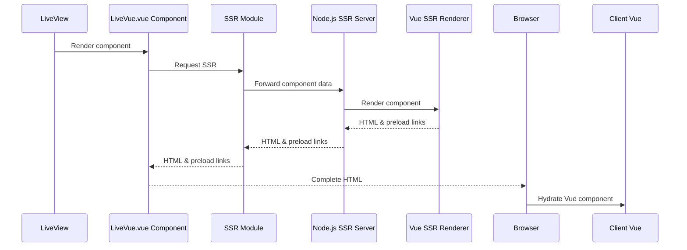
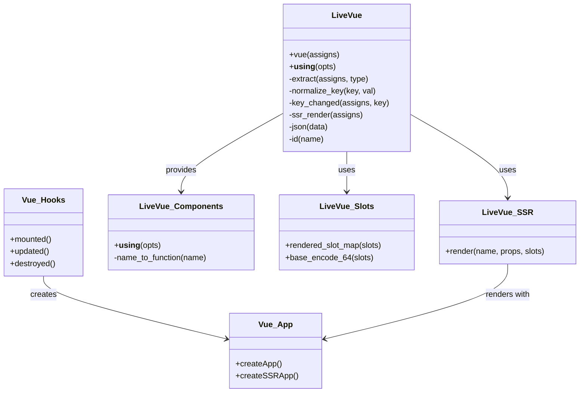
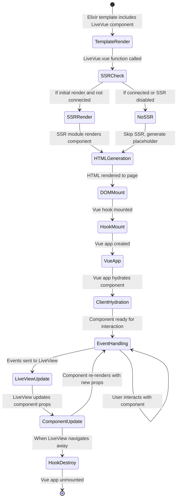

# LiveVue Architecture

This document provides a comprehensive overview of the LiveVue architecture, explaining how LiveVue enables seamless integration between Phoenix LiveView and Vue.js.

## Overview

LiveVue is a library that bridges Phoenix LiveView and Vue.js, allowing developers to use Vue components directly within Phoenix LiveView applications. It provides:

1. Server-side rendering (SSR) of Vue components
2. Automatic hydration of Vue components on the client
3. Bidirectional data flow between LiveView and Vue
4. Support for Vue slots within LiveView templates
5. Event handling between LiveView and Vue components

## High-Level Architecture

The LiveVue architecture consists of several key components working together across both server and client environments:



### Key Components

- **LiveVue Core**: The main Elixir module that provides the integration between Phoenix LiveView and Vue.js.
- **SSR Module**: An optional module that enables server-side rendering of Vue components.
- **Vue Hooks**: Phoenix LiveView hooks that handle the client-side Vue component lifecycle.
- **Vue Components**: The actual Vue.js components that are integrated with LiveView.

## Component Flow

The component flow in LiveVue shows how components are rendered and how data flows between Phoenix LiveView and Vue:



1. A Phoenix LiveView template includes a LiveVue component using the `LiveVue.vue/1` function or a generated component function.
2. The LiveVue component extracts props, slots, and event handlers from the assigns.
3. If SSR is enabled, the component is pre-rendered on the server.
4. The Vue hook on the client side creates a Vue app and mounts it to the DOM element.
5. Vue components are rendered and hydrated in the browser.

## Data Flow

The data flow in LiveVue is bidirectional, allowing LiveView to pass data to Vue components and Vue components to send events back to LiveView:



1. LiveView provides assigns to the LiveVue component.
2. The LiveVue component serializes the assigns as props for the Vue component.
3. The Vue hook extracts these props from the DOM element.
4. The Vue app receives the props and uses them to render the component.
5. When events occur in the Vue component, they are sent back to LiveView through Phoenix's JS commands.
6. LiveView processes the events and updates its state, which can trigger updates to the Vue component.

## Server-Side Rendering Process

LiveVue includes optional server-side rendering of Vue components, which provides better initial load performance and SEO benefits:



1. When a LiveView template is rendered, it calls the LiveVue.vue component.
2. The LiveVue component checks if SSR is enabled (the default setting).
3. If SSR is enabled and it's an initial page load, the component data is sent to the SSR module.
4. The SSR module communicates with a Node.js server that uses Vue's SSR renderer.
5. The rendered HTML and preload links are returned to the LiveVue component.
6. The LiveVue component inserts the HTML and preload links into the page.
7. When the page loads in the browser, the Vue client code hydrates the pre-rendered component.

## Module Structure

The key modules in LiveVue and their relationships are shown in this class diagram:



- **LiveVue**: The main module that provides the `vue/1` function for rendering Vue components.
- **LiveVue.SSR**: Handles server-side rendering of Vue components.
- **LiveVue.Components**: Provides macros for generating component functions.
- **LiveVue.Slots**: Handles the processing of slots for Vue components.
- **Vue Hooks**: Client-side hooks that manage the Vue component lifecycle.
- **Vue App**: The Vue application created on the client side.

## Component Lifecycle

The lifecycle of a LiveVue component from creation to destruction:



1. **Template Render**: A Phoenix LiveView template includes a LiveVue component.
2. **SSR Check**: The LiveVue.vue function checks if SSR should be performed.
3. **SSR Render/No SSR**: Either the component is rendered on the server or a placeholder is created.
4. **HTML Generation**: The HTML for the component is generated.
5. **DOM Mount**: The HTML is mounted in the DOM.
6. **Hook Mount**: The Vue hook is mounted on the client side.
7. **Vue App Creation**: A Vue app is created and mounted to the DOM element.
8. **Client Hydration**: If SSR was used, the component is hydrated; otherwise, it's rendered.
9. **Event Handling**: The component handles user interactions and LiveView updates.
10. **Component Update**: When LiveView updates, the component's props are updated.
11. **Hook Destroy**: When LiveView navigates away, the hook's destroyed callback is called.
12. **Vue App Unmount**: The Vue app is unmounted from the DOM.

## Configuration

LiveVue can be configured in your Phoenix application's config files. Key configuration options include:

```elixir
config :live_vue,
  # Enable or disable SSR (defaults to true)
  ssr: true,
  
  # Custom SSR module implementation
  ssr_module: MyApp.CustomSSR,
  
  # Add paths to your Vue components
  vue_paths: ["./assets/vue"]
```

## Integration with Build Tools

LiveVue includes integration with Vite for modern frontend development:

1. The `vitePlugin.ts` file provides a Vite plugin for LiveVue that handles component discovery and compilation.
2. SSR is handled through a separate Node.js server that uses Vue's SSR renderer.
3. Components can be automatically discovered and registered through the configuration. 