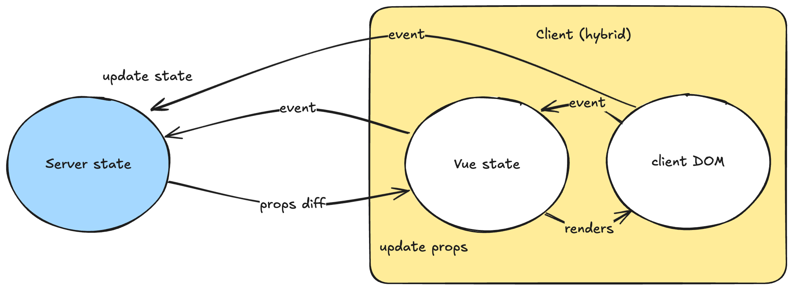

# How LiveVue Works

This guide explains the architecture and inner workings of LiveVue, helping you understand the design decisions and implementation details.

> #### Practical Usage {: .tip}
>
> Looking for practical examples? Check out [Basic Usage](basic_usage.html) for common patterns and [Getting Started](getting_started.html) for your first component.

## Overview

LiveVue bridges two different paradigms: **Phoenix LiveView** with its server-side state management and HTML over WebSockets, and **Vue.js** with its client-side reactivity and virtual DOM. The challenge is making these two systems work together seamlessly while maintaining the benefits of both.

## Architecture Diagram



## Component Lifecycle

### 1. Server-Side Rendering (SSR)

When a LiveView renders a Vue component, LiveVue generates a special `div` element with component configuration stored in data attributes. Here's what the server generates:

```elixir
# In your LiveView template
<.vue v-component="MyComponent" message={@message} v-on:click="handle_click" />
```

This produces HTML like:

```html
<div
  id="MyComponent-1"
  data-name="MyComponent"
  data-props="{&quot;message&quot;:&quot;Hello World&quot;}"
  data-handlers="{&quot;click&quot;:[&quot;push&quot;,{&quot;event&quot;:&quot;handle_click&quot;}]}"
  data-slots="{}"
  data-ssr="true"
  phx-hook="VueHook"
>
  <!-- Optional SSR content here -->
</div>
```

The component name, props serialized as JSON, event handlers, and slots are all embedded as data attributes, with an optional Phoenix LiveView hook attachment.

### 2. Client-Side Hydration

When the page loads and Phoenix LiveView connects, the `VueHook` activates. Here's the simplified flow from `hooks.ts`:

```typescript
export const getVueHook = ({ resolve, setup }: LiveVueApp): LiveHookInternal => ({
  async mounted() {
    const componentName = this.el.getAttribute("data-name") as string
    const component = await resolve(componentName)

    const props = reactive(getProps(this.el, this.liveSocket))
    const slots = reactive(getSlots(this.el))

    const app = setup({
      createApp: makeApp,
      component,
      props,
      slots,
      // ... other options
    })

    this.vue = { props, slots, app }
  }
})
```

The hook resolves the component name to the actual Vue component, makes props and slots reactive using Vue's reactivity system, mounts the Vue component (optionally hydrating existing SSR content), and configures event handlers for bidirectional communication.

### 3. Reactive Updates

When server state changes, LiveView sends new data via WebSocket. Phoenix updates only the changed data attributes, Vue's reactivity system automatically detects these changes, and only affected parts of the Vue component re-render. This happens through the `updated()` hook:

```typescript
updated() {
  Object.assign(this.vue.props ?? {}, getProps(this.el, this.liveSocket))
  Object.assign(this.vue.slots ?? {}, getSlots(this.el))
}
```

#### Props Diff Construction (Server-Side)

LiveVue implements an efficient diffing system that minimizes data transmission by sending only changed properties as JSON patches. Here's how it works:

**1. Change Detection**
LiveView's `__changed__` tracking system identifies which assigns have been modified since the last render. For simple value changes, `__changed__` contains `true` for the changed key. For complex data structures (maps, lists, structs), it stores the previous value to enable deep diffing.

**2. Struct Encoding**
Before diffing can occur, any custom structs are converted to maps using the `LiveVue.Encoder` protocol. This ensures consistent data structures that can be reliably compared and serialized.

**3. Diff Calculation**
The system processes each changed prop differently based on its complexity:

- **Simple values** (strings, numbers, booleans): Generate a direct "replace" operation since the entire value has changed
- **Complex values** (maps, lists, structs): Use the Jsonpatch library to calculate minimal differences between the old and new encoded values

**4. Path Construction**
Each diff operation includes a JSON Pointer path that precisely identifies where the change should be applied. For nested changes, paths are constructed hierarchically (e.g., `/user/email` for changing a user's email field).

**5. Serialization**
The resulting diff operations are JSON-encoded and embedded in the `data-props-diff` attribute of the component's wrapper div. This attribute is only present when there are actual changes to apply.

#### Props Diff Consumption (Client-Side)

On the client side, the Vue hook processes these diffs efficiently:

**1. Diff Extraction**
When the `updated()` hook fires, it reads the `data-props-diff` attribute and parses the JSON array of patch operations.

**2. Patch Application**
The system applies each patch operation to the reactive props object using a JSON Patch implementation. This directly modifies the existing props object rather than replacing it entirely.

**3. Reactivity Triggering**
Since the props object is reactive (created with Vue's `reactive()` function), any changes automatically trigger Vue's reactivity system. Components re-render only the parts of the template that depend on the changed data.

**4. Efficient Updates**
This approach means that even for large, complex data structures, only the specific fields that changed are updated in the DOM. For example, changing a user's email in a large user object only updates the email display, not the entire user profile.

**Performance Benefits**
This diff-based approach provides several advantages:
- Minimal network payload (only changed data is transmitted)
- Efficient client-side updates (only changed reactive properties trigger re-renders)
- Reduced memory pressure (existing objects are patched rather than replaced)
- Faster UI updates (smaller changes mean less work for Vue's virtual DOM)

The combination of server-side diff calculation and client-side patch application ensures that LiveVue can handle complex, nested data structures efficiently while maintaining real-time reactivity.

**Disabling Diffs**
For testing scenarios or debugging purposes, diffing can be disabled globally via the `enable_props_diff: false` configuration option, or per-component using the `v-diff={false}` attribute. When disabled, complete props are always sent instead of diffs, which can be useful for comprehensive testing or troubleshooting complex prop updates. See [Configuration](configuration.html#testing-configuration) for details.

## Data Flow

### Props Flow (Server → Client)

LiveView manages authoritative state and passes it to Vue components as props. When LiveView assigns are updated, the HEEX template generates new prop data, only changed props are sent over WebSocket, and the Vue component automatically re-renders with new props.

The server-side extraction logic in `live_vue.ex` ensures efficient updates:

```elixir
defp extract(assigns, type) do
  Enum.reduce(assigns, %{}, fn {key, value}, acc ->
    case normalize_key(key, value) do
      ^type -> Map.put(acc, key, value)
      {^type, k} -> Map.put(acc, k, value)
      _ -> acc
    end
  end)
end
```

#### Struct Encoding with LiveVue.Encoder

Before props are serialized and sent to the client, custom structs must be encoded using the `LiveVue.Encoder` protocol. This protocol:

1. **Converts structs to maps** for JSON serialization
2. **Enables efficient diffing** by providing a consistent data structure
3. **Ensures security** by requiring explicit field exposure
4. **Optimizes performance** by allowing minimal JSON patches

```elixir
# Example: User struct with encoder protocol
defmodule User do
  @derive {LiveVue.Encoder, except: [:password]}
  defstruct [:name, :email, :password, :created_at]
end

# When passed as props:
<.vue user={@current_user} v-component="Profile" v-socket={@socket} />

# The encoder converts the struct to:
%{
  name: "John Doe",
  email: "john@example.com",
  created_at: ~U[2023-01-01 12:00:00Z]
  # password field is excluded for security
}
```

The encoding happens in the `vue/1` component function:

```elixir
changed_props = extract(changed, :props) |> Encoder.encode()
```

This ensures that all props are in a format suitable for JSON serialization and efficient diffing.

### Event Flow (Client → Server)

There are three main approaches for handling events:

**Standard Phoenix Events** (recommended for most cases) use direct `phx-click` attributes that work inside Vue components:

```html
<button phx-click="increment">Click me</button>
```

**Programmatic Events** use `useLiveVue().pushEvent()` for complex logic:

```javascript
const live = useLiveVue()
live.pushEvent("custom_event", { data: "value" })
```

**Vue Event Handlers** use the `v-on:` syntax for reusable components:

```elixir
<.vue v-component="Counter" v-on:increment="handle_increment" />
```

The event handlers are processed on the client side by invoking `liveSocket.execJS` with the payload defined by `JS` module.

> #### Event Handling Best Practices {: .tip}
>
> Use `phx-click` for simple, direct event handling. Use `live.pushEvent()` when you need programmatic control or complex logic. Use `v-on:` syntax when creating reusable Vue components that should be decoupled from specific LiveView implementations.

## Key Design Decisions

### Hook-Based Integration

LiveVue uses Phoenix LiveView's hook system rather than a separate JavaScript framework. This provides seamless integration within LiveView's lifecycle, automatic cleanup when elements are removed, and natural compatibility with all Phoenix events.

### Reactive Props and Slots

Props and slots are made reactive using Vue's reactivity system, enabling efficient updates where only changed data triggers re-renders, full compatibility with Vue features like computed properties and watchers, and minimal overhead for prop updates.

## Performance Optimizations

### Selective Updates

LiveVue minimizes data transmission by tracking only modified props, slots, and handlers. The JSON encoding is optimized to prevent redundant work, and Phoenix updates only specific data attributes rather than re-rendering entire elements.

#### Efficient Struct Diffing

The `LiveVue.Encoder` protocol enables efficient diffing of complex data structures:

```elixir
# For complex types, use Jsonpatch to find minimal diff
old_value ->
  old_value
  |> Encoder.encode()
  |> Jsonpatch.diff(new_value)
  |> update_in([Access.all(), :path], fn path -> "/#{k}#{path}" end)
```

By converting structs to consistent map representations, LiveVue can:
- Calculate minimal JSON patches for prop updates
- Avoid sending unchanged nested data
- Reduce WebSocket payload sizes
- Improve client-side rendering performance

For example, when only a user's email changes:

```elixir
# Instead of sending the entire user struct
%{user: %{name: "John", email: "new@example.com", created_at: ~U[...]}}

# LiveVue sends only the changed field
[%{op: "replace", path: "/user/email", value: "new@example.com"}]
```

### SSR Optimization

Server-side rendering is intelligently applied only during initial page loads (dead renders), can be configured per component, and is skipped during live navigation for better performance.

### Automatic Preloading

During server-side rendering, LiveVue automatically uses the Vite-generated manifest file to inject resource preload links (`<link rel="modulepreload">` and others) for all the assets required by a component. This ensures that the browser can download necessary JavaScript and CSS files earlier in the page load process, improving perceived performance and reducing the time to an interactive page.

### Memory Management

Automatic cleanup prevents memory leaks through proper hook lifecycle management. Vue apps are unmounted when hooks are destroyed, with special handling for Phoenix navigation events and automatic removal of event listeners:

```typescript
destroyed() {
  const instance = this.vue.app
  if (instance) {
    window.addEventListener("phx:page-loading-stop", () => instance.unmount(), { once: true })
  }
}
```

## Security Considerations

### Data Sanitization

All data passed between server and client is properly sanitized. Props are safely encoded with HTML escaping using `Jason.encode!(data, escape: :html_safe)`, all user data is escaped before transmission, and events go through Phoenix's standard validation.

### Event Security

Event handling maintains Phoenix's security model where all events are validated on the server, standard Phoenix CSRF protection applies, and LiveView's authorization patterns work normally.

## Slots Implementation

Slots bridge HEEX templates and Vue components by rendering slots server-side as HTML, encoding content as Base64 for safe transport, and decoding on the client for integration into Vue's slot system:

```typescript
const getSlots = (el: HTMLElement): Record<string, () => any> => {
  const dataSlots = getAttributeJson(el, "data-slots")
  return mapValues(dataSlots, base64 => () => h("div", { innerHTML: atob(base64).trim() }))
}
```

**Limitation**: Since slots are rendered server-side, they can't contain other Vue components or Phoenix hooks.

## Debugging and Development

### Development Tools

LiveVue works with standard development tools including Vue DevTools for full component inspection and debugging, Phoenix LiveView Dashboard for server-side state monitoring, and browser DevTools for network and WebSocket inspection.

### Debug Features

Built-in debugging capabilities include debug mode for detailed logging of component lifecycle, component resolution logs to help identify loading issues, and event tracing to track events flowing between Vue and LiveView.

## Limitations and Trade-offs

### Current Limitations

Vue components can't contain other Vue components, Phoenix hooks don't work inside slots, and there's limited browser API access during server rendering.

### Design Trade-offs

The Vue runtime adds approximately 34KB gzipped to your application. There's an additional abstraction layer between Phoenix and the client, and it requires understanding both Phoenix LiveView and Vue.js.

### When to Use LiveVue

LiveVue is a good fit for complex client-side interactions, rich UI components with local state, leveraging the Vue ecosystem (animations, charts, etc.), and teams with Vue.js expertise.

Consider alternatives for simple forms and basic interactions, applications prioritizing minimal JavaScript, or teams without Vue.js experience.

## Next Steps

Now that you understand how LiveVue works:

- [Configuration](configuration.html) to customize behavior and SSR settings
- [Basic Usage](basic_usage.html) for practical patterns and examples
- [Client-Side API](client_api.html) for detailed API reference