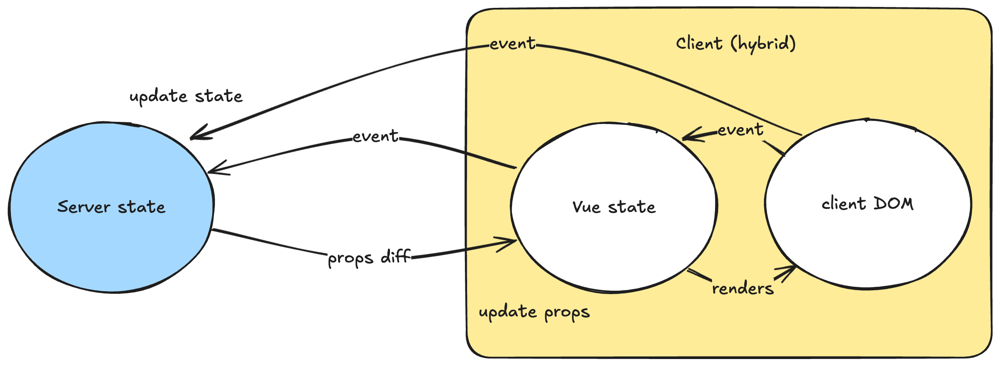

# Getting Started

Now that you have LiveVue installed, let's create your first Vue component and integrate it with LiveView.

## Creating Your First Component

Let's create a simple counter component that demonstrates the reactivity between Vue and LiveView.

1. Create `assets/vue/Counter.vue`:

```html
<script setup lang="ts">
import {ref} from "vue"

// props are passed from LiveView
const props = defineProps<{count: number}>()

// local state
const diff = ref(1)
</script>

<template>
  Current count: {{ props.count }}
  <label>Diff: </label>
  <input v-model.number="diff" type="range" min="1" max="10" />

  <button phx-click="inc" :phx-value-diff="diff">
    Increase counter by {{ diff }}
  </button>
</template>
```

2. Create a LiveView to handle the counter state (`lib/my_app_web/live/counter_live.ex`):

```elixir
defmodule MyAppWeb.CounterLive do
  use MyAppWeb, :live_view

  def render(assigns) do
    ~H"""
    <.vue count={@count} v-component="Counter" v-socket={@socket} />
    """
  end

  def mount(_params, _session, socket) do
    {:ok, assign(socket, count: 0)}
  end

  def handle_event("inc", %{"diff" => value}, socket) do
    {:noreply, update(socket, :count, &(&1 + value))}
  end
end
```

3. Add the route in your `router.ex`:

```elixir
live "/counter", CounterLive
```

## Key Concepts

This example demonstrates several key LiveVue features:

- **Props Flow**: LiveView sends the `count` value to Vue as a prop
- **Event Handling**: Vue emits an `inc` event with `phx-click` and `phx-value-diff` attributes
- **State Management**: LiveView maintains the source of truth (the counter value)
- **Local UI State**: Vue maintains the slider value locally without server involvement

Basic diagram of the flow:



If you want to understand how it works in depth, see [Architecture](architecture.html).


> #### Good to know {: .info}
>
> - Install the [Vue DevTools browser extension](https://devtools.vuejs.org/getting-started/installation) for debugging
> - In development, LiveVue enables Hot Module Replacement for instant component updates
> - Structure your app with LiveView managing application state and Vue handling UI interactions
> - For complex UIs with lots of local state, prefer Vue components over LiveView hooks

## Next Steps

Now that you have your first component working, explore:
- [Tutorial](tutorial.html) for a more comprehensive example
- [Basic usage](basic_usage.html) for more examples
- [FAQ](faq.html) for common questions and troubleshooting
- [Troubleshooting](troubleshooting.html) for common issues